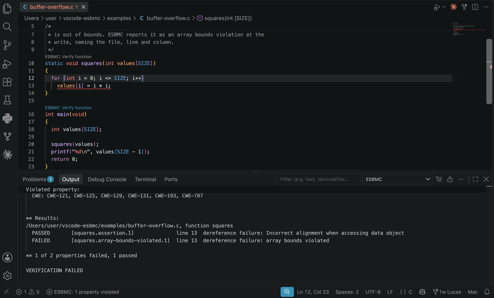
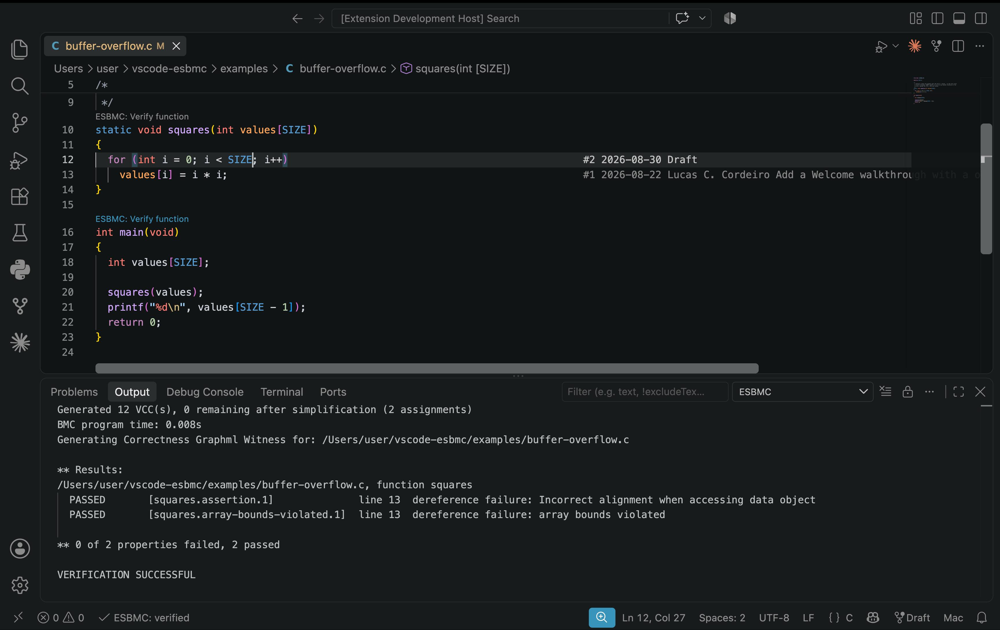

# ESBMC for Visual Studio Code

[](https://github.com/esbmc/vscode-esbmc/actions/workflows/on-pr-master.yml?query=branch%3Amaster+event%3Apush)

Find bugs in C, C++, Python, and Solidity without leaving the editor, using
[ESBMC](http://esbmc.org/), an SMT-based model checker that proves properties
rather than sampling inputs. A failure comes with a counterexample; a success
means no execution violates the property, not merely that none was found.



The bundled `examples/buffer-overflow.c` writes one element past the end of its
array. ESBMC names the property, the line, and the corresponding CWEs.

## Install

Not on the VS Code Marketplace or Open VSX yet. Until it is, build the VSIX
from a clone and install that:

```sh
npm ci
npx @vscode/vsce package --out vscode-esbmc.vsix
code --install-extension vscode-esbmc.vsix
```

Then run **ESBMC: Install latest version** from the Command Palette
(<kbd>Ctrl</kbd>/<kbd>Cmd</kbd> + <kbd>Shift</kbd> + <kbd>P</kbd>).

The extension downloads the release build for your platform and unpacks it into
its own storage directory, so nothing is written to `$HOME/bin` and no `PATH`
change is needed. ESBMC already on your `PATH` is used by default.

New to it? **Help → Welcome → Get started with ESBMC** walks through installing
ESBMC, opening a bundled example and reading the counterexample it produces.

## How it works

Verification runs ESBMC over the open file, with flags built from your
settings, and reports the result three ways:

- **Problems panel and squiggles** — each violated property is placed on the
  line that violates it, read from ESBMC's SARIF report rather than scraped
  from its log.
- **Status bar** — the verdict, and how many properties failed. Click it to
  open the full output.
- **ESBMC Counterexample view** — the steps that reach the violation, each
  navigating to its line and showing the variable values ESBMC pinned there.
  It appears in the Explorer once a run produces a trace.
- **ESBMC output channel** — the command line that ran, and everything ESBMC
  printed.



Correcting the loop bound to `i < SIZE` and re-running turns both properties
green. This is the distinction bounded model checking buys: the second result
says no execution up to the bound violates the property, not that none was
sampled.

Run **ESBMC: Show current flags** to see the command line your settings produce
before running anything.

## Commands

| Command | What it does |
| --- | --- |
| `ESBMC: Verify file` | Verify the active file |
| `ESBMC: Show current flags` | Show the flags the current settings produce |
| `ESBMC: Show output` | Open the ESBMC output channel |
| `ESBMC: Install latest version` | Download and install ESBMC |
| `ESBMC: Update to latest version` | Update an existing install |
| `ESBMC: Open example program` | Open the bundled example |
| `ESBMC: Explain and repair with AI` | Verify, then ask a model to explain the counterexample |

A CodeLens above each function verifies that function on its own.

## Settings

Two settings control the editor integration:

| Setting | Default | Meaning |
| --- | --- | --- |
| `esbmc.editor.verifyOnSave` | `false` | Verify a supported file every time it is saved |
| `esbmc.editor.timeout` | `60` | Kill a run after this many seconds; `0` waits indefinitely |

Everything else maps to an ESBMC flag, grouped under **Front End**, **BMC**,
**Solver**, **Property Checking**, **k-Induction**, **Concurrency Checking**
and **AI Integration** in the Settings UI. Each value documents the flag it
produces. Only settings that differ from their default emit anything, which is
why **ESBMC: Show current flags** exists.

## Ask ESBMC in chat

Type `@esbmc` in the Chat view to verify the file you are looking at, or one
you attach with `#file:`, and get the verdict back in the conversation.

| | |
| --- | --- |
| `@esbmc /verify` | Run ESBMC and report the verdict. No model involved, so this works with no AI set up at all |
| `@esbmc /explain` | Verify, then explain the counterexample |
| `@esbmc /fix` | Verify, then propose a program that verifies |
| `@esbmc <your question>` | Verify, then answer the question you asked |

Everything but `/verify` goes to a model, and answers come from whichever one
is selected in the chat model picker, so no second install and no API key of
its own. Verification uses the flags your settings produce, so `@esbmc` and
**ESBMC: Verify file** agree on the same file, and the squiggles, the Problems
panel and the **ESBMC Counterexample** view follow along.

ESBMC reads the file from disk. With unsaved changes, `@esbmc` says so and
verifies the saved version.

## Use ESBMC from an AI agent

The extension ships an MCP server exposing a `verify` tool, so agents in
Claude Code, Cursor, Copilot agent mode and Cline can run ESBMC themselves and
read the counterexample. Point the agent at the entry point inside the
installed extension:

```json
{
  "mcpServers": {
    "esbmc": {
      "command": "node",
      "args": ["<extension-path>/out/mcp/main.js"]
    }
  }
}
```

`<extension-path>` is what **Developer: Show Running Extensions** reports for
this extension. The tool takes a `file`, and optionally `flags` and
`timeoutSeconds`; it answers with the verdict, each violated property and its
location, and the counterexample trace.

## Remote development

The extension declares `extensionKind: ["workspace"]`, so with **Remote-SSH**,
**WSL** or **Dev Containers** it runs where the code is rather than on the
local UI host. ESBMC is installed and executed on the remote machine — the
supported route if you want a Linux ESBMC from a Windows or macOS desktop.

## Explain and repair (optional)

**ESBMC: Explain and repair with AI** verifies the active file and then asks a
model about the counterexample, in the ESBMC output channel. `esbmc.ai.backend`
picks who answers, for both this command and `@esbmc`:

| `esbmc.ai.backend` | Who answers | What it needs |
| --- | --- | --- |
| `chat` (default) | The model VS Code chat already has | A chat provider such as GitHub Copilot |
| `ollama` | A model on your own machine | [Ollama](https://ollama.ai/) running locally |
| `esbmc-ai` | [ESBMC-AI](https://github.com/esbmc/esbmc-ai) | `pip install esbmc-ai`, a config file and a provider API key |

One backend never stands in for another: if the one you chose cannot answer,
the verdict is still reported and the reply says which setting to change.

**Ollama** keeps everything offline. Install and start it, pull the model named
in `esbmc.ai.model`, and confirm it answers:

```bash
curl https://ollama.ai/install.sh | sh
ollama serve
ollama pull llama3.1:8b
curl http://localhost:11434/api/tags
```

`Error: listen tcp 127.0.0.1:11434: bind: address already in use` means it is
already running; check with `systemctl status ollama`. Host and model are
`esbmc.ai.host` and `esbmc.ai.model`.

**ESBMC-AI** repairs the program and re-verifies its own patch rather than
answering in prose, so it is the only backend that can tell you a fix works.
It needs its own TOML configuration and a provider API key; point
`esbmc.ai.esbmcAi.configFile` at the file, or set `ESBMCAI_CONFIG_FILE`. A
repair loop runs for minutes, which is what `esbmc.ai.timeout` bounds rather
than `esbmc.editor.timeout`.

## Troubleshooting

| Symptom | Likely cause | Fix |
| --- | --- | --- |
| `ESBMC: not found` | ESBMC is not installed | Run **ESBMC: Install latest version** |
| Verification reports no verdict | ESBMC failed before checking anything | Open the ESBMC output channel |
| `@esbmc` is not offered in chat | VS Code older than 1.95, or no chat provider installed | Update VS Code; install a chat provider such as GitHub Copilot |
| `No chat model is available` | Nothing provides a model to VS Code chat | Install a chat provider, or set `esbmc.ai.backend` to `ollama` |
| `Ollama did not answer` | Ollama is not running | Run `ollama serve` |
| `ESBMC-AI is not installed` | Not on `PATH` | `pip install esbmc-ai`, or set `esbmc.ai.esbmcAi.path` |
| AI output is very slow | Model too large for the machine | Try a smaller model in `esbmc.ai.model` |

## Contributing

Build instructions, the test suite and the release process are in
[CONTRIBUTING.md](CONTRIBUTING.md). Issues and pull requests are welcome at
[github.com/esbmc/vscode-esbmc](https://github.com/esbmc/vscode-esbmc).

## License

Apache-2.0; see [LICENSE](LICENSE). This covers the extension only. ESBMC
itself is distributed under its own terms, which differ and are more involved
— see [COPYING](https://github.com/esbmc/esbmc/blob/master/COPYING) in
[esbmc/esbmc](https://github.com/esbmc/esbmc). The extension runs ESBMC as a
subprocess and does not link against it.
